<p align="right">
  <a href="README.md">English</a> · <strong>简体中文</strong>
</p>

<p align="center">
  
</p>

> GoPress 是一个用 Go 编写的内容管理框架与 CMS 引擎，面向需要自托管、主题化、插件化和 API 扩展能力的网站与内容应用。
> 它将内容模型、后台管理、主题模板、插件扩展、SEO、媒体处理和 REST API 组织为一套可组合的工程框架。
> 适合用于企业官网、内容站、产品展示站、文档站，以及需要在 Go 技术栈中保留 CMS 编辑体验的定制项目。

[](https://go.dev)
[](LICENSE)

---

## GoPress 是什么？

GoPress 旨在把传统 CMS 中经过验证的内容模型、主题系统、插件扩展和后台管理能力，放到 Go 的运行时与工程生态里重新组织。它提供统一的内容模型、数据驱动的后台 CRUD、主题模板引擎、Hook / Filter 扩展点、REST API、SEO 基础设施、多级缓存、媒体变体和多站点配置能力。

这个项目不是 WordPress 的逐行重写，也不是对 PHP 生态的替代宣言。GoPress 更关注一类具体场景：开发者希望保留 CMS 的编辑体验和扩展模型，同时获得 Go 在部署、并发、可观测性和长期维护上的工程优势。

## 项目状态

GoPress 当前处于 **beta** 阶段。核心内容模型、后台管理、主题引擎、插件机制、SEO、缓存、媒体管线和示例主题已经具备基础可用性，但公开发布前仍需要更多真实项目验证、基准测试、迁移文档和安全审计。

如果你计划在生产环境使用，建议先从内部站点、企业官网、文档站或内容型应用开始，并根据实际流量与编辑流程做压测和备份策略。

## 为什么做 GoPress？

成熟 CMS 生态已经证明了“内容模型 + 主题 + 插件 + 后台管理”这套抽象的长期价值。GoPress 借鉴其中稳定的产品形态，同时用 Go 的单二进制部署、goroutine 并发模型、静态类型和标准化工具链，降低自托管 CMS 在部署、扩展和维护上的复杂度。

下面的对比不是为了评价不同技术栈的优劣，而是说明 GoPress 的设计取舍：

| 维度 | WordPress (PHP) | GoPress (Go) |
|------|-----------------|--------------|
| 运行方式 | PHP-FPM / Web Server 组合，围绕请求生命周期运行 | Go 单进程服务，适合常驻内存模型 |
| 扩展方式 | 主题与插件生态成熟，运行时动态加载灵活 | Go 接口与 Hook 注册，强调类型安全和可维护性 |
| 缓存策略 | 通常通过插件、对象缓存或反向代理组合增强 | 内置内存 / Redis / 数据库多级缓存路径 |
| 定时任务 | 常见方案包括 WP-Cron 或系统 Cron | 由服务进程内的调度器执行 |
| 部署形态 | Web Server、PHP 运行时、数据库等多组件协作 | 编译后以单一服务进程交付，外接数据库与可选 Redis |

## 核心设计原则

1. **内容优先** — 以统一的 `Content + Meta` 模型承载文章、联系留言，以及主题声明的自定义内容类型。
2. **主题与引擎分离** — 主题负责呈现，引擎负责路由、查询、SEO、媒体和后台能力。
3. **插件通过接口扩展** — 插件通过 Go 接口、Hook 和 Filter 注册能力，减少隐式运行时耦合。
4. **缓存作为基础能力** — 内置内存缓存、Redis 缓存和页面缓存路径，并在缺少 Redis 时自动降级。
5. **SEO 内建** — URL 重写、永久链接、Canonical、Sitemap、Meta、重定向等能力在核心层统一处理。
6. **API First** — 内容类型可暴露 REST API，并通过 Swagger / OpenAPI 描述接口。
7. **多实例隔离** — 支持表前缀和站点级配置，便于多实例共享基础设施并隔离数据边界。

## 主题与后台界面预览

GoPress 内置了一套实用的后台 CMS，并提供多个面向真实站点场景的示例主题。下面的预览展示了项目当前的 UI 方向：前台主题侧重行业化视觉表达，后台则提供聚焦内容管理、主题配置和媒体编辑的工作界面。

### 后台 UI

首次运行时，安装器会引导完成数据库连接、站点初始化和管理员账号创建，然后进入后台 CMS。

| 数据库配置 | 站点初始化 | 完成安装 |
|---|---|---|
| 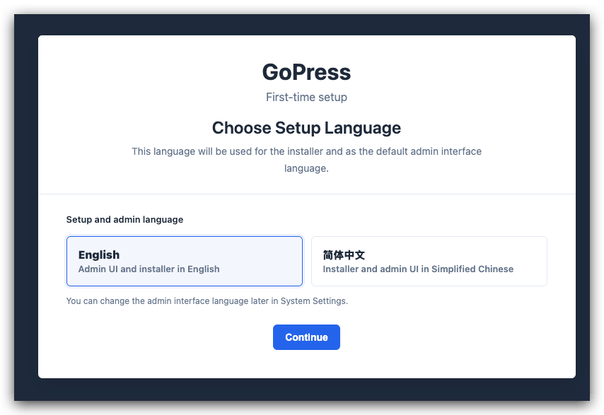 | 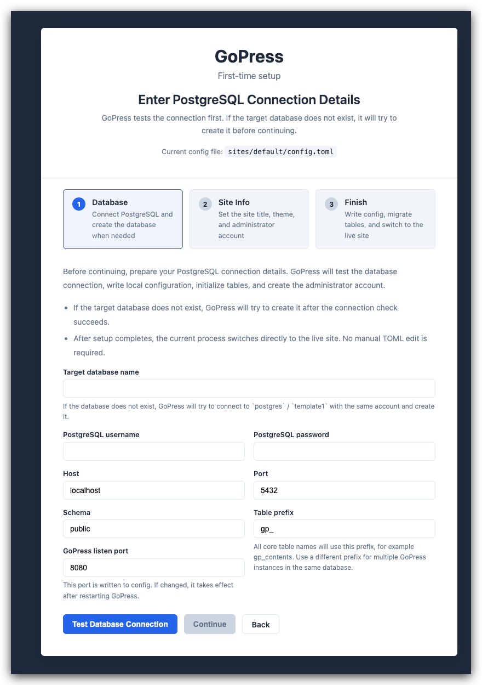 | 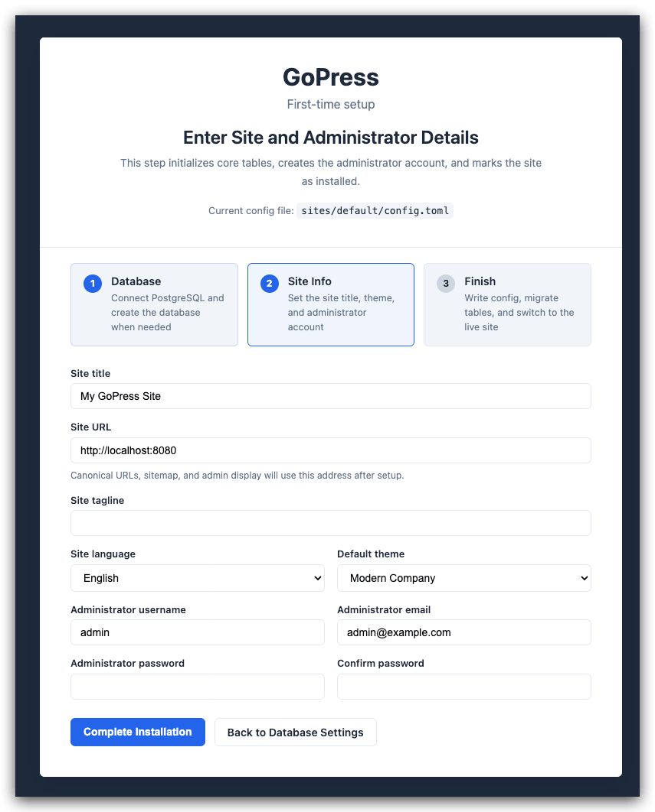 |

| 内容工作台 | 主题设置 | 媒体与编辑 |
|---|---|---|
| 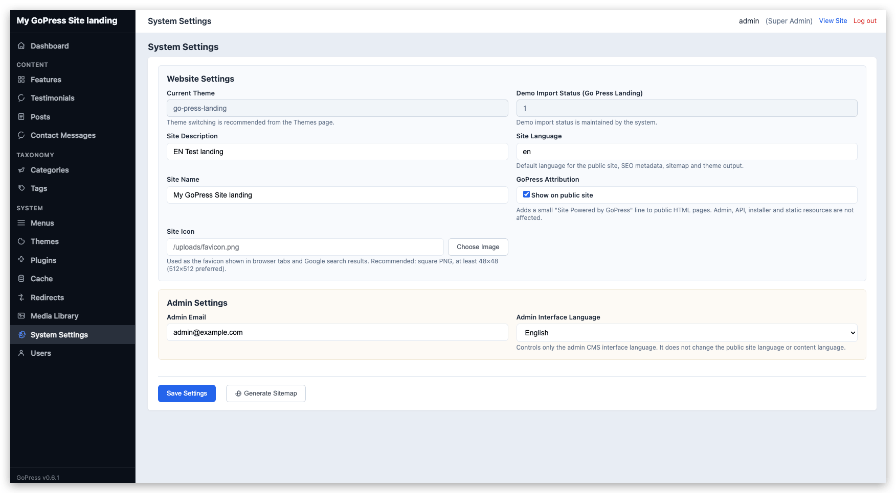 | 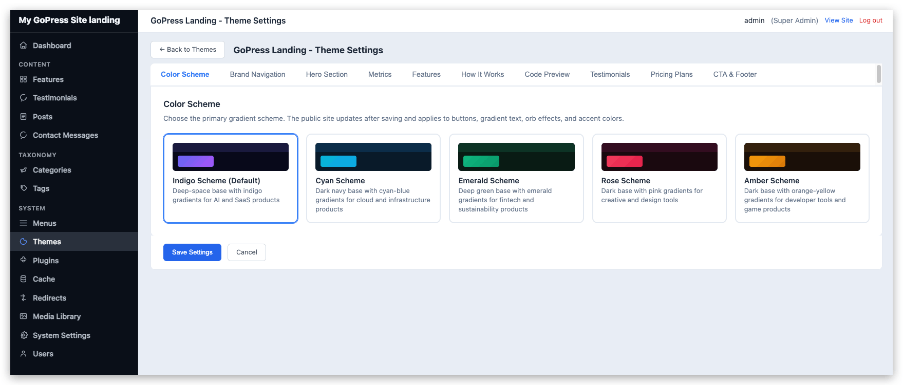 | 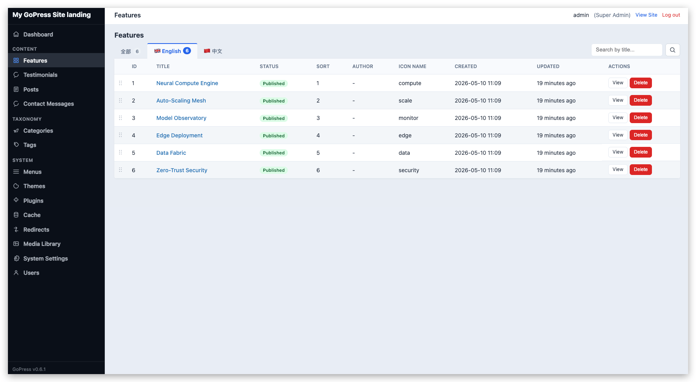 |

### 主题展示

| Axis Form | FloraFi |
|---|---|
|  | 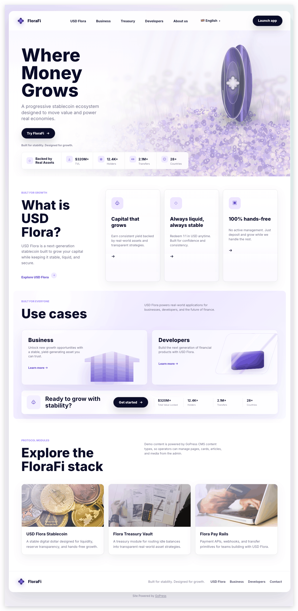 |

| Modern Company（[真实站点](https://hurricanetechs.com)） | Civic Estate |
|---|---|
| 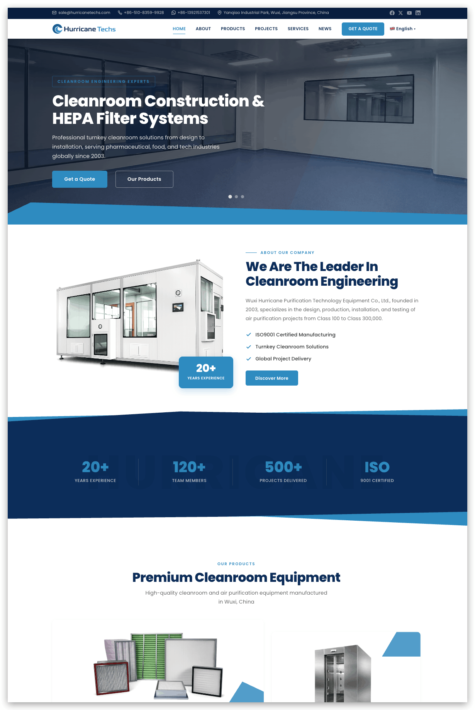 |  |

<details>
<summary>更多内置主题预览</summary>

| Atelier Slate（[真实站点](https://gopress.xyz)） | Terra Trail |
|---|---|
|  | 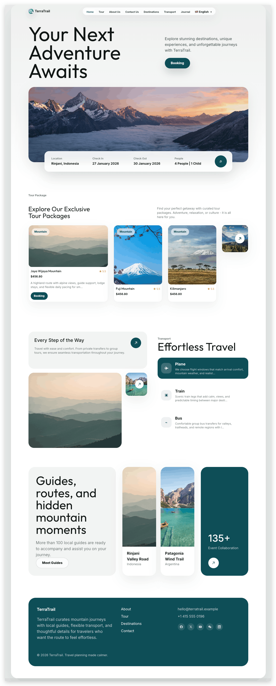 |

| GoPress Landing Indigo | GoPress Landing Rose |
|---|---|
| 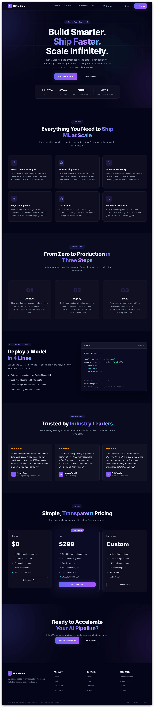 | 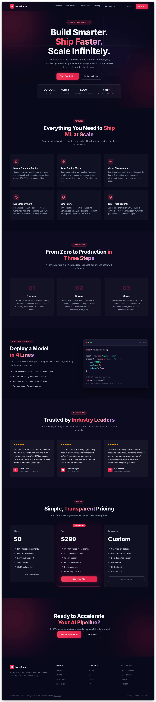 |

</details>

---

## 快速开始

### 环境要求

- Go 1.25+
- PostgreSQL 14+
- Redis 7+（可选，无 Redis 时自动降级为纯内存缓存）
- `cwebp`（可选，用于生成 WebP 变体；缺失时自动回退为 JPG/PNG 变体）

### 安装 & 运行

GoPress 自带一个小型编排 CLI `gopress`。它会在启动时扫描 `themes/` 和 `plugins/` 目录、自动重新生成 autoload 包，然后启动服务。新增主题或插件**不需要手动改任何 import**——把目录拖进去，重新执行 `gopress serve` 即可被识别加载。

想先试一下的话直接本地构建即可，不需要全局安装。

```bash
# 克隆项目
git clone https://github.com/0xmattg/go-press.git
cd go-press

# 安装依赖
go mod download

# 把 gopress CLI 构建到 ./build/（不需要全局安装）
make gopress

# 启动服务（首次启动进入 Web 安装器）
./build/gopress serve

# 或指定已有站点配置（所有 flag 都会原样透传给 cmd/server）
./build/gopress serve -config sites/localhost/config.toml

# 构建生产单二进制（autoload 在编译期已经固化）
./build/gopress build               # -> build/gopress-server
./build/gopress build -o ./myserver # 自定义输出路径
```

`make help` 列出所有 Make 目标，`./build/gopress help` 列出所有 CLI 子命令。

#### 可选：全局安装

如果你长期使用 GoPress，可以把 CLI 装到 `$PATH` 上，就不用每次都带 `./build/` 前缀：

```bash
make install      # 装到 $GOBIN（或 $GOPATH/bin）
gopress serve     # 装完之后任意目录都能跑
```

> **1c1g 小机器编译？** `go build` 默认按 CPU 并行编译，容易被小 VPS 的 OOM killer 杀掉。前面加 `GOFLAGS="-p=1 -v"` 强制串行即可，例如 `GOFLAGS="-p=1 -v" make gopress`。详见[安装指南](docs/guide/zh-CN/getting-started/installation.md#小内存机器编译)。

启动后访问：

| 地址 | 说明 |
|------|------|
| `http://localhost:8080` | 前台网站 |
| `http://localhost:8080/admin` | 后台 CMS |
| `http://localhost:8080/swagger/index.html` | API 文档 |
| `http://localhost:8080/api/v1/content` | REST API |

完整安装指南见 [docs/guide/zh-CN/getting-started/installation.md](docs/guide/zh-CN/getting-started/installation.md)。

---

## 文档

完整文档已拆分到 [`docs/guide/`](docs/guide/) 目录，按 GitBook 多页结构组织：

| 章节 | 内容 |
|---|---|
| [介绍](docs/guide/zh-CN/README.md) | 项目定位、设计原则 |
| [快速开始](docs/guide/zh-CN/getting-started/installation.md) | 安装、配置、Web 安装器 |
| [架构](docs/guide/zh-CN/architecture/overview.md) | 引擎启动流程、内容模型、前台身份登录、URL/SEO、缓存、i18n、Content Scope、Hook 系统 |
| [后台管理](docs/guide/zh-CN/admin/overview.md) | 后台 CMS、扩展点、菜单管理 |
| [主题开发](docs/guide/zh-CN/themes/overview.md) | 创建主题、SEO 接入规范、图片管线、媒体变体 |
| [插件开发](docs/guide/zh-CN/plugins/overview.md) | 创建插件、Hook 列表、内置 multilang / seo-extras / code-snippets / gopress-analytics |
| [参考资料](docs/guide/zh-CN/reference/project-structure.md) | 项目结构、数据库表前缀、REST API、技术栈、路线图 |

API 接口规范单独存放，由 `swag` 从代码注解自动生成：

| 文件 | 说明 |
|---|---|
| [docs/swagger.json](docs/swagger.json) | OpenAPI 规范（JSON） |
| [docs/swagger.yaml](docs/swagger.yaml) | OpenAPI 规范（YAML） |
| [docs/docs.go](docs/docs.go) | Swagger Go 包，由 server 入口文件引用 |

重新生成：`go run ./cmd/gendoc/`

---

## 主要特性速览

### 前台用户与身份登录

<table>
  <tr>
    <td align="center" width="50%">
      <br>
      <strong>Google / Gmail 登录 · 已支持</strong><br>
      <sub>内置 Google OIDC 插件，支持 Gmail 与 Google Workspace 账号、Authorization Code Flow、PKCE、已验证身份绑定和可撤销 GoPress Session。</sub>
    </td>
    <td align="center" width="50%">
      <br>
      <strong>MetaMask 钱包登录 · 规划中</strong><br>
      <sub>Provider-neutral 身份模型已为后续 SIWE / EIP-4361 插件留好边界，钱包协议不会耦合进 core 或主题。</sub>
    </td>
  </tr>
</table>

- **Provider-neutral 账号核心** — Email/Password 可空、以 `(provider, issuer, subject)` 为稳定键的外部身份、策略控制的注册/关联，以及数据库支持的可撤销 Session。
- **后台注册策略** — 分别控制开放用户注册、外部身份登录、外部身份自动注册、账号关联和受权限上限保护的新用户默认角色。
- **插件协议边界** — 身份插件负责验证 OIDC、钱包签名或未来协议，core 只接收验证完成的 `VerifiedIdentity`。
- **主题统一 helper** — `currentUser` / `isLoggedIn` / `loginURL` / `logoutURL` / `loginProviders` 让主题在不知道具体身份插件的情况下渲染账号 UI。

完整核心模型、Google 配置、插件契约、主题接入与 MetaMask 规划见 [前台用户注册与身份登录](docs/guide/zh-CN/architecture/public-authentication.md)。

### 引擎核心

- **统一内容模型** — `Content` + `ContentMeta` + `ContentType` 注册表；核心保留 `post` / `contact_message`，主题通过 `theme.toml` 声明自定义类型
- **配置驱动内容路由** — `theme.toml` 的 `rewrite_slug` 和可选 `templates = { archive = "...", single = "..." }` 统一驱动归档 URL、详情 URL、Sitemap、后台永久链接和动态模板解析。`product` / `service` / `showcase` 只是示例类型，不是框架内置假设。
- **链式查询构建器** — 下面以主题声明的 `product` 内容类型为例：`ContentQuery.Type("product").Published().Taxonomy("category", "hepa").Paginate(1, 20)`
- **Hook 事件总线** — `AddAction` / `DoAction` / `AddFilter` / `ApplyFilter`，热拔插友好（每个 Add 返回 `Handle` 可精准 Remove）
- **多级缓存** — L1 内存 + L2 Redis，自动降级，页面缓存中间件 < 1ms 命中
- **Worker Pool** — Goroutine 工作池 + Cron 定时调度
- **核心 i18n** — go-i18n + 3 层翻译回退（DB → locale → message ID），可翻译设置项注册表

### URL / SEO

- **统一站点信息** — admin「系统设置 > 网站设置」`site_name` / `site_description` / `site_timezone`，全主题共用一份来源；发布时间按站点时区输入和展示，数据库统一存 UTC
- **SEOBuilder** — home/archive/single 三类页面统一生成 `<meta description>` + `<link canonical>` + `og:*` + JSON-LD（Article/WebSite schema）+ 爬虫友好的 favicon links
- **`seoHeadFor` 模板助手** — reflection-based 安全实现，对 `gin.H` 和自定义 struct 都不会因字段缺失白屏
- **Per-content SEO 覆盖** — 内置 `seo-extras` 插件提供 Yoast 风格 4 字段覆盖（Title / Description / OG Image / Robots），核心通过 `seo.content.meta` filter 开放扩展
- **Sitemap 多语言 hreflang** — `SitemapGenerator.AddTransformer()` 让多语言插件按需贡献 `<xhtml:link hreflang>` 备选链接
- **站点级公开生成物** — 后台生成的 sitemap 和 favicon 文件写入 `sites/{host}/public/`，多站点部署互不覆盖
- **301/302 重定向** — 数据库驱动 + 内存缓存 + 命中计数

### 后台 CMS

- **数据驱动 CRUD** — 按 ContentType 注册表自动生成列表/编辑界面，零样板代码
- **主题内容模型配置化** — `theme.toml` 的 `[[content_types]]` 驱动后台导航、CRUD、REST API、Rewrite、模板映射和菜单图标
- **RBAC 权限** — admin/editor/author/subscriber，全后台 `checkPermission` 加固
- **列表显示选项与分页** — 内容列表支持按当前页面动态列生成显示选项、标题搜索、日期/分类筛选和服务端分页
- **邮件设置与通知** — 独立 SMTP 设置页，默认使用 go-mail SMTP 驱动并保留 Go 标准库选项，`mail.mail_key` 保存在站点级 `config.toml`，支持 Gmail 常用的 `587 + STARTTLS`、测试邮件和新联系留言邮件通知开关
- **拖拽排序 + 富文本** — Quill 2.0 编辑器、媒体选择器、内容列表 HTML5 DnD
- **后台扩展点** — `admin.HookContentListTabs` / `admin.HookContentPermalinkPrefix` / `admin.content_form.fields` / `admin.content.saved` / `mail.message` 等通用 hook，多语言/SEO/通知等插件按需注入

### 主题与插件

- **BaseTheme 运行时引擎** — 嵌入即获得配置驱动 URL 解析、动态归档/详情渲染、模板层级回退（WordPress 风格）和 SEO 自动注入
- **统一 FuncMap** — `BaseFuncMap()` 单一来源下发：`buildURL` / `archiveURL` / `contentURL` / `pageTitleFor` / `seoHeadFor` / `menuByLocation` / `isMenuURLActive` / `T` / `currentLang` / `langPrefixURL` / `renderHook` / `responsiveImage*`
- **主题模板插槽** — `theme.head.end` / `theme.body.open` / `theme.footer.end` / `header.nav.after` 组成前台插件接入契约，主题只声明语义位置，插件按需输出 HTML
- **响应式图片管线** — 上传时生成 WebP + JPG/PNG 变体（thumb/480w/768w/1024w/1440w/full），模板用 `responsiveImage` 输出 `<picture>`
- **插件热拔插** — `Bus.AddAction/AddFilter` 返回 `Handle`，`Deactivate` 中 `Remove*` 干净下线，运行时即时切换无需重启
- **零交叉耦合** — 主题和插件之间不存在直接调用或类型依赖，core 是唯一交汇点

### 内置主题（8 个）

`atelier-slate` / `axis-form`（Axis Form，建筑设计） / `florafi`（FloraFi，稳定币/金融科技） / `civic-estate` / `financial-news` / `go-press-landing` / `modern-company` / `terra-trail`

详见 [docs/guide/zh-CN/themes/overview.md](docs/guide/zh-CN/themes/overview.md)。

### 内置插件

- **multilang** — WPML 风格内容翻译 + 菜单翻译 + 网站设置翻译 + 语言前缀路由 + 智能跳转
- **seo-extras** — Yoast 风格 per-content SEO 覆盖（4 字段：title/description/og:image/robots）
- **code-snippets** — WPCode 风格站点级代码注入（`<head>` 末尾、`<body>` 开头、`</body>` 前）
- **gopress-analytics** — GoPress 官方自托管访问统计，支持 PV、UV、新访客、访问趋势、访客构成和热门页面分析
- **google-identity** — 基于 Provider-neutral 前台认证核心，为 Gmail 和 Google Workspace 账号提供 Google OIDC 登录与注册

详见 [docs/guide/zh-CN/plugins/overview.md](docs/guide/zh-CN/plugins/overview.md)。

---

## 性能目标

以下是当前架构的目标区间，公开发布前仍需要补充可复现的 benchmark、测试环境说明和压测脚本。

| 指标 | 目标值 |
|------|--------|
| 页面缓存命中响应 | < 1ms |
| 首次渲染（无缓存） | < 50ms |
| 并发连接数 | 50,000+ |
| QPS（缓存命中） | 100,000+ |
| QPS（无缓存） | 5,000+ |
| 内存占用（空闲） | < 50MB |

---

## 技术栈

Gin / GORM / PostgreSQL / Redis / golang-jwt / Viper + TOML / log/slog / go-i18n / Quill 2.0 / swaggo/swag

完整选型说明见 [docs/guide/zh-CN/reference/tech-stack.md](docs/guide/zh-CN/reference/tech-stack.md)。

---

## 贡献

欢迎提交 Issue 和 Pull Request。开始前请先阅读 [CONTRIBUTING.md](CONTRIBUTING.md)，路线图见 [docs/guide/zh-CN/reference/roadmap.md](docs/guide/zh-CN/reference/roadmap.md)。

## 开源协议

[MIT License](LICENSE)
