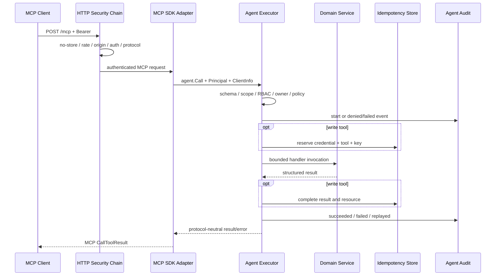

# Agent and MCP Layered Architecture

GoPress treats Agent as a stable Core capability and MCP as a replaceable
protocol adapter. This follows the same dependency rule as themes and plugins:
extensions depend on generic Core contracts; Core does not depend back on an
extension implementation.

## Dependency Direction

```text
MCP client -> plugins/gopress-mcp -> core/agent -> generic Core domains
business plugin -> core/plugin.AgentHost -> core/agent.Registry
active theme -> core/content.Registry

core -X-> gopress-mcp
gopress-mcp -X-> theme
theme -X-> gopress-mcp
```

Theme-declared content types affect generic content tools through the Content
Registry only. The adapter neither reads private theme options nor imports
theme packages.

## Code Map

```text
core/agent/
  tool.go                 Tool, Call, Result, PermissionRequirement
  registry.go             concurrent registry, revision, handles
  principal.go            principal and scopes
  credential.go           user/service-account credentials
  authorize.go            scope + RBAC + ownership
  policy.go               read_only / safe_write policy
  executor.go             mandatory execution pipeline
  validation.go           restricted JSON Schema validation
  idempotency.go          write idempotency state machine
  audit.go                Agent call audit
  core_tools.go           six read tools
  core_write_tools.go     six write tools

core/content/command.go   shared content mutation invariants
plugins/gopress-mcp/      protocol, HTTP, admin, settings
```

## Engine Assembly

The Engine constructs one site-level Registry, Policy, Credential Service,
Idempotency Store, Audit Store, Authorizer, and Executor. It registers Core read
and write tools against generic content, taxonomy, media, option, hook, and
cache services.

The public plugin capability is intentionally narrow:

```go
type AgentHost interface {
    AgentToolRegistry() *agent.Registry
    AgentExecutor() *agent.Executor
}
```

The official adapter privately composes additional Core capabilities for
credentials, audit, policy, options, hooks, admin authentication, and RBAC. No
MCP type crosses back into Core.

## Request Path



The HTTP chain applies no-store headers, bounded source rate limiting,
cross-origin protection, mandatory Bearer authentication, protocol gating, and
the official SDK Streamable HTTP handler. Protocol errors and Tool/domain
errors remain separate.

## Permission-Aware Discovery

For each authenticated request the adapter asks `Executor.VisibleTools` for a
scope/RBAC/policy-filtered set. It still registers the full Registry with the
SDK so an explicit call to a hidden tool reaches Core and produces a stable
denial audit. A list middleware removes hidden descriptions and returns a
private 30-second TTL plus Agent revision.

## Domain Reuse

Content reads use context-aware repository queries and the Content Registry.
Writes use `content.CommandService`, which enforces registered/editable types,
type plus ID boundaries, declared metadata, reserved routes, sanitization,
transactions, optimistic locking, explicit transitions, hooks, and page-cache
invalidation.

Taxonomy reads stay within taxonomies attached to the requested type. Media
reads hide filesystem paths, while metadata writes are limited to alt text,
title, and caption and trigger the shared media mutation observer.

## Persistence

Prefixed Core tables store:

| Model | Purpose |
|---|---|
| `ServiceAccount` | Passwordless non-human principal; Core exists, stock MCP UI does not manage it yet |
| `Credential` | Subject, token digest, scopes, audience, expiry, revocation, last use |
| `IdempotencyRecord` | Credential/tool/key uniqueness, request digest, state, result and resource, 24-hour default TTL |
| `AuditEvent` | Request/client/principal/tool/risk/status/error/duration and redacted digests |

Raw credentials and argument/content values are not stored in Agent audit.
Completed idempotency records do retain structured result JSON for correct
replay and should be protected as site database data.

## Lifecycle and Revision

Registry register/revoke operations increment a revision. Handles include an
owner and generation so stale handles cannot remove later registrations.
Serializable snapshots are sorted and strip handlers/resolvers. Policy has its
own revision, and discovery combines registry and policy change signals.

Deactivating the adapter removes route hooks and returns the runtime policy to
read-only. Re-activation reloads the persisted protocol-neutral Agent Policy.

OAuth discovery, refresh tokens, advanced MCP primitives, and third-party Tool
governance remain later phases and must preserve the same
`adapter -> core/agent -> domain` direction.
