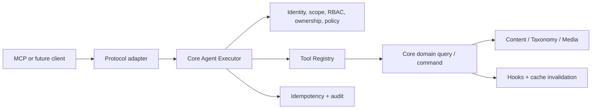

# Agent and MCP Overview

GoPress Agent capability is not a shortcut from a model to arbitrary REST or
database operations. It is a governed machine-operation boundary that lets AI
agents, automation clients, and future protocol adapters use site capabilities
with explicit identity, least privilege, risk policy, idempotency, and audit.

The implementation is currently **Safe Write Beta (Phase 3)**. Phases 0–3 are
complete. OAuth 2.1 production hardening is Phase 4; Resources, Prompts, Tasks,
MCP Apps, and third-party Tool governance are Phase 5.

## Why Agent Is a Core Capability

Giving a model an OpenAPI catalog leaves every client to solve the same hard
problems: which endpoints are suitable tools, who a machine credential
represents, how current RBAC and ownership apply, how retries avoid duplicate
writes, how risk is disabled per site, and how every attempt is audited without
persisting secrets or content values.

GoPress therefore separates capability from protocol:

- `core/agent` owns protocol-neutral tools, principals, credentials,
  authorization, policy, execution, idempotency, and audit.
- Core domain services own actual content, taxonomy, and media rules.
- The disabled-by-default `plugins/gopress-mcp` package owns MCP, HTTP, Bearer
  mapping, and admin controls only.
- Core does not import the MCP SDK or identify a client, theme, or business
  plugin.

## Current Capability Matrix

| Capability | Status |
|---|---|
| Core Agent Registry and Executor | Implemented |
| Principal, short-lived Credential, scope plus RBAC | Implemented |
| Ownership and type/ID boundary checks | Implemented |
| Write idempotency, optimistic locking, confirmation | Implemented |
| Mandatory Agent audit | Implemented |
| MCP `2026-07-28` and `2025-11-25` | Implemented |
| Stateless Streamable HTTP `/mcp` | Implemented |
| Six read tools | Implemented |
| Six Safe Write tools | Implemented, all disabled by default |
| Admin policy, credentials, diagnostics, and audit | Implemented |
| OAuth 2.1 browser authorization | Not implemented |
| Resources, Prompts, Tasks, MCP Apps | Not implemented |
| Admin governance for third-party scopes/write tools | Not implemented |

## Design Principles

1. **Off and read-only by default** — the adapter plugin is inactive by default;
   activation creates the endpoint but the site profile remains `read_only`.
2. **Authorization only narrows** — a valid audience-bound credential, required
   scope, current account and RBAC, ownership when applicable, and site risk
   policy must all agree.
3. **One domain rule set** — Agent writes use the same Content Command Service,
   transactions, hooks, sanitization, and cache invalidation as the admin.
4. **Small stable Tool surface** — generic tools accept `content_type` and read
   the active Content Registry instead of generating theme-specific tools.
5. **Fail closed** — unavailable principal refresh, schema, authorization, or
   audit services reject execution; internal causes are not returned.

## Module Guide

- [Getting Started](getting-started.md)
- [Layered Architecture](architecture.md)
- [Tools and Execution](tools-and-execution.md)
- [Identity, Authorization, and Security](security.md)
- [Extension Development](extension-development.md)
- [Operations and Testing](operations-and-testing.md)

For administrator-oriented instructions and full curl examples, see
[GoPress MCP Plugin](../plugins/gopress-mcp.md). The Phase decision history is
maintained in the
[Roadmap and Contributions](../reference/roadmap.md).
