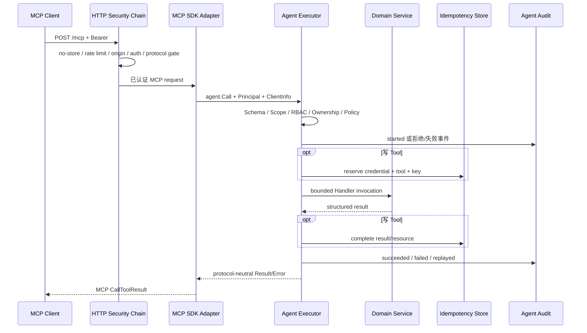

# Agent 与 MCP 分层架构

GoPress 将 Agent 设计成 Core 的稳定能力层，将 MCP 设计成可替换的协议适配器。
这个方向与主题、插件的既有边界一致：具体扩展依赖 Core 的通用契约，Core 不
反向依赖某个扩展实现。

## 依赖方向

```text
MCP client
  -> plugins/gopress-mcp
     -> core/agent
        -> generic Core domain services

business plugin
  -> core/plugin.AgentHost
     -> core/agent.Registry

active theme
  -> core/content.Registry

core -X-> gopress-mcp
gopress-mcp -X-> theme
theme -X-> gopress-mcp
```

主题只通过 Content Registry 影响通用内容 Tool 能看见哪些类型、字段和分类法，
不会 import 或调用 MCP 插件。MCP 插件也不会读取主题私有 option 或模板。

## 代码模块

```text
core/
  agent/
    tool.go                  Tool / Call / Result / PermissionRequirement
    registry.go              并发 Registry、Revision、可撤销 Handle
    principal.go             Principal、Scope、上下文
    credential.go            User/ServiceAccount Credential 生命周期
    authorize.go             Scope + RBAC + Ownership
    policy.go                read_only / safe_write 与逐 Tool 策略
    executor.go              强制执行管线
    validation.go            受限 JSON Schema 与 Payload 校验
    idempotency.go           写操作幂等状态机
    audit.go                 Agent 调用审计
    core_tools.go            六个 Core 只读 Tool
    core_write_tools.go      六个 Core 写 Tool
  content/command.go         后台与 Agent 共用的内容写命令
  audit/                     跨后台/传输的通用审计基础

plugins/gopress-mcp/
  plugin.go                  生命周期、Host 边界、/mcp 装配
  server.go                  官方 SDK、协议与 HTTP 安全适配
  admin.go                   凭证、策略、诊断、审计接口
  settings.go                设置数据与 Policy 持久化
  templates/admin/           四 Tab 管理界面
```

## Engine 装配

Engine 初始化领域服务后，创建一套站点级 Agent 运行时：

```text
agent.Registry
agent.Policy
agent.CredentialService
agent.IdempotencyStore
agent.AuditStore
agent.Authorizer
agent.Executor
```

Executor 持有 Registry、Principal Validator、Authorizer、Idempotency Store、
Audit Recorder 与 Risk Policy。Core 随后调用 `RegisterCoreReadTools` 和
`RegisterCoreWriteTools` 注册 12 个通用 Tool。

Engine 向插件暴露的公共 Agent 能力只有：

```go
type AgentHost interface {
    AgentToolRegistry() *agent.Registry
    AgentExecutor() *agent.Executor
}
```

官方 MCP 插件因为还需要协议认证和后台管理，在插件内部定义更窄的组合 Host，
额外获取 Credential Service、Audit Store、Tool Policy、Options、Hook Bus、
后台认证与 RBAC。这个内部接口不把 MCP 类型泄漏回 Core。

## 请求路径



HTTP 包装从外到内依次执行 `private, no-store`、来源限流、跨源保护、强制
Bearer 认证、协议版本门控和官方 SDK Streamable HTTP Handler。协议错误与 Tool
业务错误分开：非法协议消息由协议层处理，领域拒绝返回结构化 Tool Error。

## MCP Adapter 的可见性设计

Adapter 为当前请求重新构造一个 SDK Server：

1. Credential 先被解析成 Principal。
2. `Executor.VisibleTools` 按 Policy、Scope 与可静态判断的 RBAC 生成可见集合。
3. Adapter 向 SDK 注册完整 Registry，以便显式调用隐藏 Tool 时仍进入 Executor，
   产生稳定的权限拒绝与审计。
4. `tools/list` 中间件再移除当前 Principal 不可见的描述。
5. 列表返回 `cacheScope: private`、30 秒 TTL 与 Agent Revision。

这种方式既不向客户端主动披露无权 Tool，又不会让恶意客户端通过直接构造
`tools/call` 绕过 Core 或逃避审计。

## 领域服务复用

### 内容

读 Tool 使用 `content.Repository.QueryContext` 与 Content Registry。写 Tool 使用
`content.CommandService`，负责：

- 注册类型与只读类型检查。
- ContentType + ID 双条件查询，跨类型 ID 对外表现为 Not Found。
- 允许字段、Meta 声明、Slug 与保留路由校验。
- HTML 清理、事务与乐观锁。
- Create、Update、Publish、Trash、Restore 独立状态转换。
- Mutation Observer 触发 Core Hook 与页面缓存失效。

### 分类与媒体

分类 Tool 只返回指定 ContentType 实际挂载的 taxonomy。媒体读 Tool 返回安全
URL 与元数据，不返回服务器路径；媒体写 Tool 只允许 alt、title、caption，
成功后触发 `media.metadata.updated` 与缓存失效。

## 数据模型

所有表使用当前站点前缀：

| 模型 | 作用 |
|---|---|
| `agent.ServiceAccount` | 无密码、仅通过 Agent Credential 使用的非人主体；Core 已实现，当前 MCP 后台尚未提供管理 UI |
| `agent.Credential` | 主体、Token 摘要、Scope、Audience、过期、撤销、最后使用时间 |
| `agent.IdempotencyRecord` | Credential + Tool + Key 唯一记录、请求摘要、状态、结果与资源引用，默认 24 小时 TTL |
| `agent.AuditEvent` | Request/Trace、主体、Credential、Tool、风险、状态、错误码、耗时与脱敏摘要 |

凭证明文、Content 正文和 Tool 参数值不会写入这些 Agent 管理表。幂等表为完成
重放保存结构化结果 JSON，这是执行正确性数据，不会出现在审计列表；应继续按
站点数据库的敏感数据等级保护。

## 生命周期与 Revision

- Registry 每次成功注册、撤销或按 Owner 批量撤销都会递增 Revision。
- Handle 保存 Tool 名、Owner 和 generation；旧 Handle 不能误删后来同名注册。
- Snapshot 按 Tool 名稳定排序，并移除 Handler 与 PermissionResolver 后才能序列化。
- Policy 有独立 Revision；可见 Tool Snapshot 将 Registry 与 Policy Revision
  合成，使客户端缓存能感知策略变化。
- 停用 MCP 插件会移除路由 Hook 并把运行时 Policy 回落到只读；重新激活时从
  Core Agent Policy option 加载已保存配置。

## 当前边界与后续演进

Phase 3 没有 OAuth 发现/授权服务器、Refresh Token、Resources、Prompts、Tasks
或 MCP Apps。当前 Transport 无状态，Credential、幂等与审计依赖站点数据库。
Phase 4/5 必须继续保持 `adapter -> core/agent -> domain` 依赖方向，不能为了
OAuth 或客户端兼容把协议判断写进领域层。
