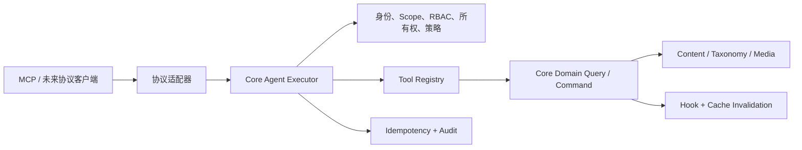

# Agent 与 MCP 总览

GoPress 的 Agent 能力不是一组直接映射数据库或 REST API 的快捷接口，而是一层
可治理的机器操作边界。它允许 AI Agent、自动化客户端或未来其他协议适配器在
明确身份、最小权限、风险策略、幂等和审计约束下使用站点能力。

当前实现处于 **Safe Write Beta（Phase 3）**：Phase 0–3 已完成；OAuth 2.1
生产化属于 Phase 4，Resources、Prompts、Tasks、MCP Apps 与第三方 Tool 治理
属于 Phase 5。

## 为什么单独建立 Agent Core

直接让模型读取 REST/OpenAPI 虽然也能发请求，但会把几个关键问题留给每个
客户端重复解决：

- 哪些 API 适合成为高层、语义稳定的 Agent Tool。
- 当前机器凭证代表谁，账号或角色变化后是否立即生效。
- Token Scope、Core RBAC、资源类型和所有权如何组合。
- 写请求断线重试时如何避免重复创建、重复发布或覆盖新编辑。
- Tool 是否只读、发布、破坏性或关键风险，以及站点能否独立关停。
- 参数、结果、失败和拒绝如何统一审计，而不保存敏感正文或 Token。
- MCP、REST、CLI 或未来协议如何复用同一领域规则而不产生旁路 CRUD。

因此 GoPress 将“Agent 能力”与“MCP 协议”拆成两个层次：



- `core/agent` 定义协议无关的 Tool、Principal、Credential、Authorizer、Policy、
  Executor、幂等与审计。
- Core 内容、分类、媒体服务提供真实领域查询和写命令。
- 默认停用的 `plugins/gopress-mcp` 只处理 MCP、HTTP、Bearer Token 与后台设置。
- Core 不 import MCP SDK，也不识别某个客户端、主题或业务插件。

## 当前交付能力

| 能力 | 当前状态 |
|---|---|
| Core Agent Registry 与 Executor | 已实现 |
| Principal、短期 Credential、Scope + RBAC | 已实现 |
| 所有权、IDOR 与 ContentType 边界 | 已实现 |
| 写幂等、乐观锁、显式确认 | 已实现 |
| 强制 Agent 审计 | 已实现 |
| `2026-07-28` / `2025-11-25` MCP | 已实现 |
| 无状态 Streamable HTTP `/mcp` | 已实现 |
| 6 个只读 Tool | 已实现 |
| 6 个 Safe Write Tool | 已实现，默认全部关闭 |
| 插件后台、凭证、策略、诊断、审计查询 | 已实现 |
| OAuth 2.1 浏览器授权 | 未实现 |
| Resources / Prompts / Tasks / MCP Apps | 未实现 |
| 第三方 Scope 与写 Tool 的后台治理 | 未实现 |

## 设计原则

### 1. 默认关闭、默认只读

`gopress-mcp` 是默认停用插件。激活后 Endpoint 才存在，但站点 Tool Profile
仍是 `read_only`。选择 `safe_write` 也不会自动开放全部写能力，管理员还必须
逐个启用 Tool，并重新签发包含对应 Scope 的 Token。

### 2. 授权条件只做收紧

客户端、Tool annotation 或 Token Scope 都不能单独扩大权限：

```text
Credential 有效且 Audience 匹配
AND Token 含所需 Scope
AND 当前账号与角色仍有效
AND Core RBAC 允许 resource.action
AND 需要时资源所有权匹配
AND 站点 Risk Policy 允许该 Tool
```

### 3. 领域规则只有一份

Agent 不直接使用 GORM Repository 做任意写入。内容写操作经过
`content.CommandService`，与后台共用类型、状态、Slug、Meta、事务、Hook 和
缓存失效规则。发布、回收和恢复是独立命令，不能通过通用 update 偷渡状态。

### 4. 工具面小而稳定

GoPress 不为每个主题 ContentType 生成一套 Tool。通用 Tool 使用
`content_type` 参数读取当前 Content Registry，因此主题切换或新增合法类型时
无需让 MCP 插件知道主题名称。

### 5. 失败关闭

审计、Principal 刷新、Schema 或权限服务不可用时，Executor 拒绝执行。内部
错误不会把数据库信息、路径、Secret 或 panic 文本直接返回客户端。

## 模块导航

- [快速上手](getting-started.md) — 从激活插件到跑通第一次读写调用。
- [分层架构](architecture.md) — Core、领域服务、MCP 适配器和数据模型。
- [Tool 与执行管线](tools-and-execution.md) — Tool 契约、Registry、Executor 和
  12 个内置 Tool。
- [身份、授权与安全](security.md) — Credential、Scope、RBAC、所有权、幂等、
  乐观锁、审计与 HTTP 防护。
- [扩展开发](extension-development.md) — 第三方插件如何注册 Tool，以及当前
  治理限制。
- [运维与测试](operations-and-testing.md) — 后台、代理、错误排查、测试分层与
  上线清单。

实际的管理员操作和完整 curl 示例也可直接查看
[GoPress MCP 插件指南](../plugins/gopress-mcp.md)；Phase 决策历史见
[路线图与贡献](../reference/roadmap.md)。
